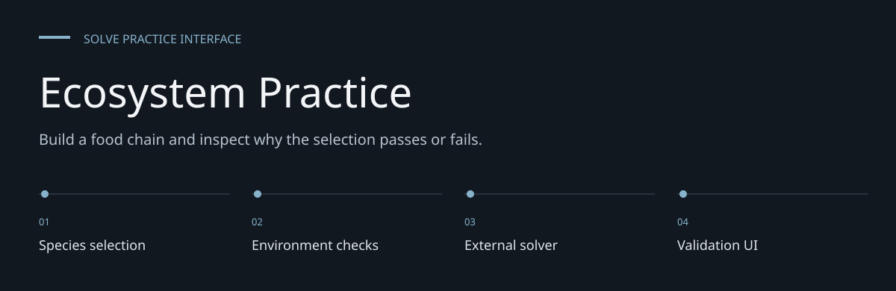
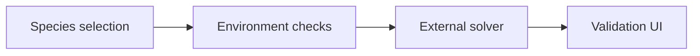
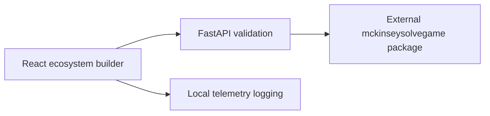

# Ecosystem Practice

**Build a food chain and inspect why the selection passes or fails.**

A local React / FastAPI practice interface for selecting an ecosystem, checking environmental
constraints and evaluating a food chain through an external solver package.
It is an independent practice project; there is no verified assessment success probability.


[Architecture](docs/ARCHITECTURE.md) · [Evaluation guide](docs/EVALUATION.md)

**Contents:** [The challenge](#the-challenge) · [Walkthrough](#walk-through-the-project) ·
[Implementation](#implementation-state) · [Design choices](#engineering-choices) ·
[Next evidence](#next-evidence-to-collect)

---

## The challenge

Ecosystem practice involves choosing compatible species while tracking food and environmental
constraints. This interface combines a visual selection canvas, timer and calculator with a solver
adapter, so selections can be inspected through feedback rather than a static worksheet.

## System at a glance



## Walk through the project

### 1. Load the catalog

The frontend asks the species endpoint for selectable records. Verify the backend and its external
solver dependency before judging UI completeness.

### 2. Choose the environment

Inspect the selected depth, temperature and salinity conditions; the adapter applies environmental
checks to the candidate species.

### 3. Assemble the ecosystem

Drag species into the map and inspect automatic validation feedback. The timer and calculator
support practice, not official assessment scoring.

### 4. Read validation and telemetry

Inspect the food-chain result and local event logging. A valid practice selection is not a
measured probability of success in an official assessment.

## Workflow

- Browse the species catalog and drag species onto the ecosystem map.
- Select environment conditions and inspect validation feedback.
- Use the countdown timer and calculator while practicing.
- Record interface telemetry through the backend service.



## Dependencies and launch

The frontend manifest declares React 19, Vite 7, Zustand 5 and react-dnd 16.
Python dependencies are pinned in `backend/requirements.txt`.

```bash
git clone https://github.com/DanushArun/mckinsey-solve-interactive.git
cd mckinsey-solve-interactive
python3 -m venv .venv
source .venv/bin/activate
python -m pip install -r backend/requirements.txt
```

The backend imports `mckinseysolvegame`, which is neither committed nor declared in that
requirements file. Supply a compatible solver installation before attempting backend launch.
The older command `pip install -e ../mckinseysolvegame` assumes a sibling checkout that is absent.

After supplying that dependency:

```bash
cd backend
python -m uvicorn app:app --reload --port 8000
```

In another terminal, from the repository root:

```bash
cd frontend
npm ci
npm run dev
```

Open `http://localhost:5173`; API documentation is at `http://localhost:8000/docs`.

## Source and verification

- [app.py](backend/app.py): species, validation and telemetry API.
- [solver_service.py](backend/services/solver_service.py): solver adapter/environment checks.
- [telemetry_service.py](backend/services/telemetry_service.py): event logging.
- [frontend/src/components](frontend/src/components): ecosystem, timer and calculator UI.
- [test_api.py](backend/test_api.py): API test source.

The frontend declares build and lint commands, but no test script.
Source and setup paths were reviewed; no end-to-end solver run was performed for this README.
A local validity result does not certify performance in an official assessment.

## Engineering choices

**Separate UI and solver.** The interface delegates food-chain reasoning to a Python service.

**Environment checks are explicit.** Location compatibility is distinct from calorie feasibility.

**No invented success percentage.** Repository source cannot establish assessment success
probability.

## Implementation state

| State | Current evidence |
| --- | --- |
| Present | Species/environment UI, timer and calculator |
| Present | Validation/telemetry adapter source |
| Missing dependency | mckinseysolvegame installation in this checkout |
| Not measured | Official assessment outcomes or end-to-end reliability |

The [architecture guide](docs/ARCHITECTURE.md) maps these statements to source entry points.
The [evaluation guide](docs/EVALUATION.md) separates inspection, executable checks and
domain validation, with the next evidence needed for each project.

## Next evidence to collect

- Supply and pin the compatible solver dependency.
- Run API tests and record fixture-based validation results.
- Verify interaction and timer behavior in the browser.
