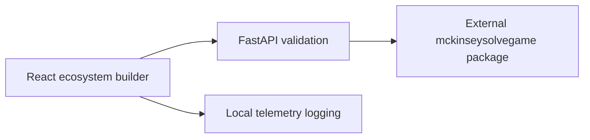

# Ecosystem Solve Practice Interface

A local React / FastAPI practice interface for selecting an ecosystem, checking environmental
constraints and evaluating a food chain through an external solver package.
It is an independent practice project; there is no verified assessment success probability.

## Workflow

- Browse the species catalog and drag species onto the ecosystem map.
- Select environment conditions and inspect validation feedback.
- Use the countdown timer and calculator while practicing.
- Record interface telemetry through the backend service.



## Dependencies and launch

The frontend manifest declares React 19, Vite 7, Zustand 5 and react-dnd 16.
Python dependencies are pinned in `backend/requirements.txt`.

```bash
git clone https://github.com/DanushArun/mckinsey-solve-interactive.git
cd mckinsey-solve-interactive
python3 -m venv .venv
source .venv/bin/activate
python -m pip install -r backend/requirements.txt
```

The backend imports `mckinseysolvegame`, which is neither committed nor declared in that
requirements file. Supply a compatible solver installation before attempting backend launch.
The older command `pip install -e ../mckinseysolvegame` assumes a sibling checkout that is absent.

After supplying that dependency:

```bash
cd backend
python -m uvicorn app:app --reload --port 8000
```

In another terminal, from the repository root:

```bash
cd frontend
npm ci
npm run dev
```

Open `http://localhost:5173`; API documentation is at `http://localhost:8000/docs`.

## Source and verification

- [app.py](backend/app.py): species, validation and telemetry API.
- [solver_service.py](backend/services/solver_service.py): solver adapter/environment checks.
- [telemetry_service.py](backend/services/telemetry_service.py): event logging.
- [frontend/src/components](frontend/src/components): ecosystem, timer and calculator UI.
- [test_api.py](backend/test_api.py): API test source.

The frontend declares build and lint commands, but no test script.
Source and setup paths were reviewed; no end-to-end solver run was performed for this README.
A local validity result does not certify performance in an official assessment.
